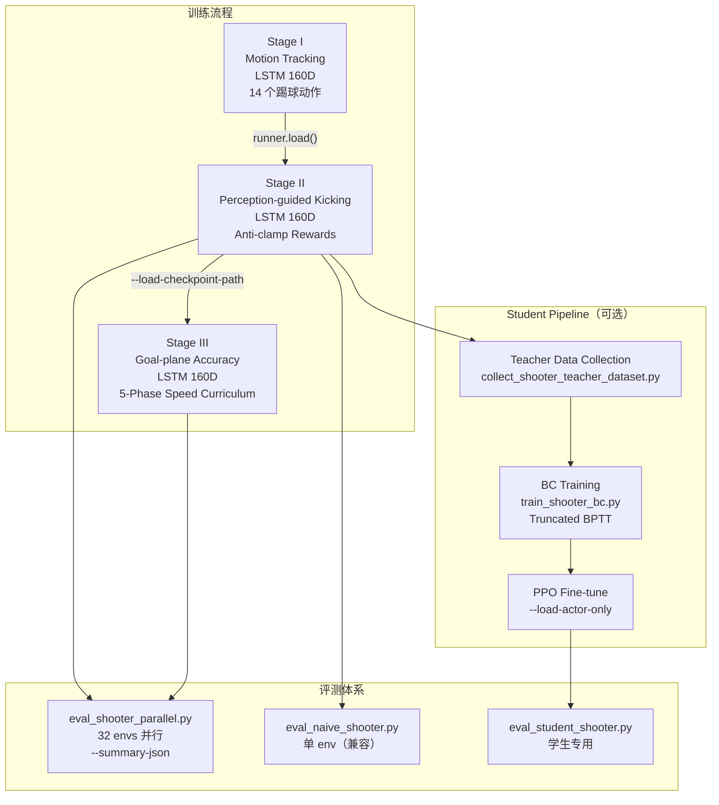
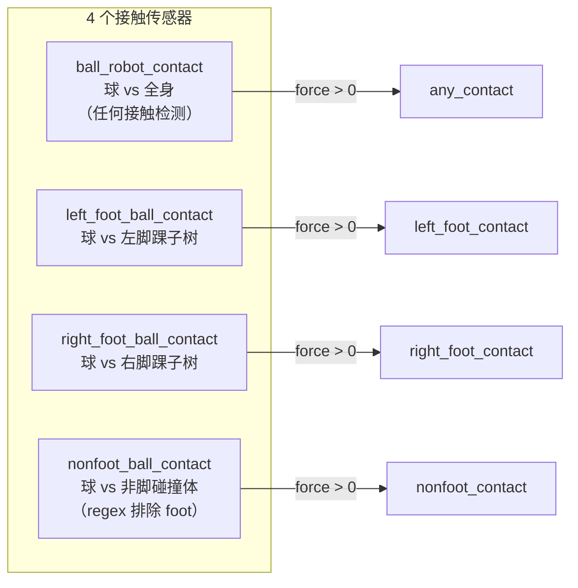
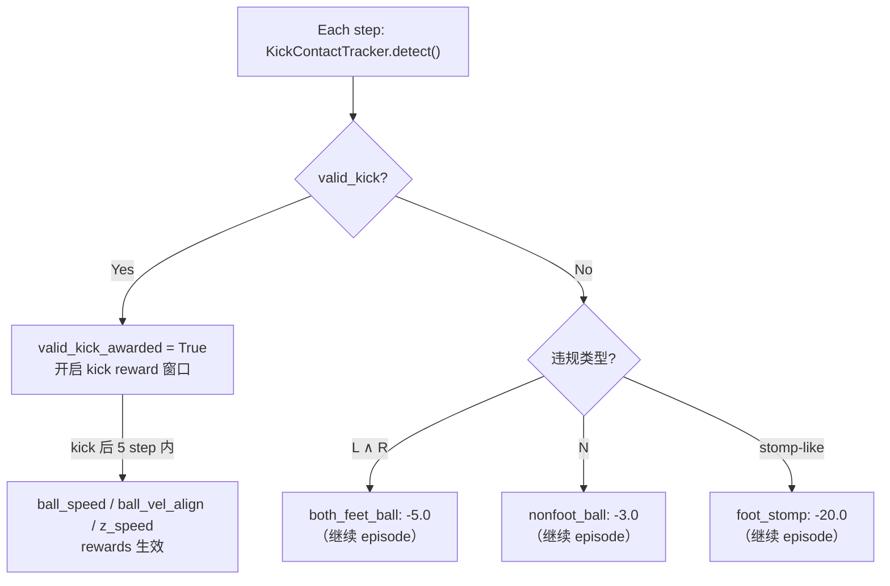
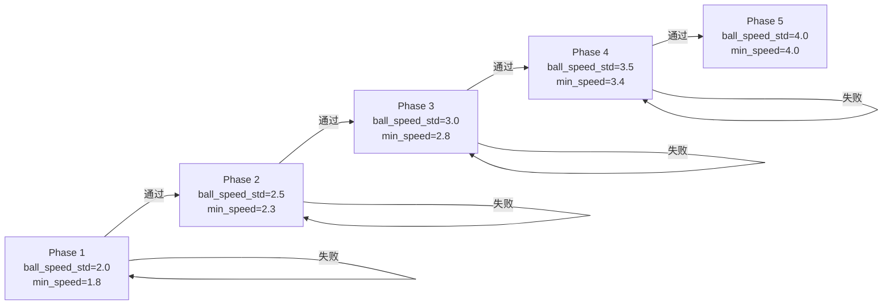
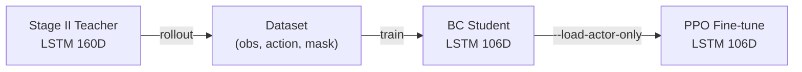

# Shooter 训练模块改动说明

> **作者**：[@2021533097](https://github.com/2021533097)
> **负责模块**：Shooter（射门）训练与评测
> **日期**：2026-06-14
> **提交分支**：`pr-shooter`

---

## 一、概述

基于 PAiD 论文 ([arXiv:2602.05310](https://arxiv.org/abs/2602.05310)) 的 Progressive Perception-Action 框架，对 Shooter 模块进行了以下扩展：

1. **Stage I/II 训练任务注册与观测统一** — 整理为可注册的 task，160D 观测，Stage I→II 一键迁移
2. **Anti-clamp 奖励体系** — 解决 reward hacking（夹球/碰球骗 reward），4 传感器 + 4 软惩罚
3. **Stage 3 精度 + 速度 Curriculum** — goal-plane accuracy reward + 5 阶段自动速度递进，目标 4-5 m/s
4. **Motion-free 学生蒸馏 Pipeline** — BC 蒸馏 → PPO 微调，降低 motion reference 依赖
5. **并行评测脚本** — 32 env 并行，crossing 检测，target error 指标，JSON 输出

### 架构总览



---

## 二、动机与问题

原 HumanoidSoccer 的 Shooter 实现存在三个核心问题：

### 2.1 Reward Hacking（奖励欺骗）

原实现只有**一个** `ball_robot_contact` 接触传感器（球 vs 全身），无法区分"脚踢球"和"身体碰球"。机器人演化出以下策略：

| 策略 | 效果 | 问题 |
|------|------|------|
| 双脚夹球 | 球被夹在双脚之间缓慢移动 | `proximity` reward 持续走高，但球速为 0 |
| 身体撞球 | 身体靠向球，产生接触力 | `contact` reward 误触发，但没有实际踢球动作 |

**后果**：policy 收敛到"夹着球走"而非"踢球"，射门成功率虚高但球速极低。

### 2.2 观测空间不统一

Stage I 观测 154D，Stage II 观测 160D。维度不同导致 Stage I→II 迁移需要**手动部分加载权重**（约 40 行代码），容易出错。

**后果**：训练脚本复杂，下游合作者难以复现。

### 2.3 无目标点精度约束

Stage II 只有速度和方向的连续 reward，没有"球最终是否穿过目标点"的确认信号。policy 追求速度但方向精度不可控。

**后果**：球速约 2.1 m/s 即停滞，方向精度不可控。

---

## 三、改动文件清单

### 3.1 修改的文件

#### 核心 MDP 层

| 文件 | 改动内容 | 新增函数 |
|------|----------|----------|
| `src/tasks/soccer/mdp/shooter_rewards.py` | 新增 anti-clamp 软惩罚（4 个）+ goal-plane crossing helper + 2 个 goal-plane reward | `both_feet_ball_contact()`, `nonfoot_ball_contact()`, `foot_stomp_penalty()`, `foot_lift_penalty()`, `_goal_plane_crossing()`, `goal_plane_accuracy()`, `goal_miss_penalty()` |
| `src/tasks/soccer/mdp/shooter_kick_detection.py` | 重写 `KickContactTracker`，用 4 个传感器判定合法踢球；`_handle_resample()` 新增 8 个 goal-plane 状态清理 | `detect()` (rewritten), `detect_any_single_foot()` (student variant), `_handle_resample()` (extended) |
| `src/tasks/soccer/mdp/shooter_commands.py` | 集成 `KickContactTracker` 到 `MultiMotionSoccerCommand` | `kick_contact_tracker` 属性 |
| `src/tasks/soccer/mdp/__init__.py` | 新函数导出 | — |

#### 配置层

| 文件 | 改动内容 |
|------|----------|
| `src/tasks/soccer/config/training/stage1_env_cfg.py` | 观测 154D→160D，新增 `target_destination_pos` 观测项；`episode_length_s` 使用 `SETTINGS` |
| `src/tasks/soccer/config/training/stage2_env_cfg.py` | 新增 anti-clamp rewards 配置（`both_feet_ball`, `nonfoot_ball`, `foot_stomp`, `foot_lift`, `is_terminated`）；`ee_body_pos` 阈值 0.25→0.35m；foot tracking 分离 |
| `src/tasks/soccer/config/g1/training_env_cfgs.py` | 新增 `unitree_g1_stage2_env_cfg`, `unitree_g1_stage3_env_cfg`, `unitree_g1_student_shooter_env_cfg` |
| `src/tasks/soccer/config/g1/rl_cfg.py` | 新增 `SoccerRecurrentRunner`（LSTM rnn_type/hidden_dim/layers 注入），`unitree_g1_student_shooter_ppo_runner_cfg` |
| `src/tasks/soccer/config/g1/__init__.py` | 注册 Stage 1/2/3 + Student 四个训练 task |
| `src/tasks/soccer/config/eval/eval_shooter_cfg.py` | Eval 环境配置（基于 Stage 2 + goal entity） |
| `src/tasks/soccer/config/eval/__init__.py` | 注册 `Eval-Shooter` 和 `Eval-Shooter-Stage3` |

#### 脚本层

| 文件 | 改动内容 |
|------|----------|
| `scripts/train.py` | LSTM resume 支持；`--load-checkpoint-path`（指定任意 ckpt）；`--load-actor-only`（只加载 actor 权重）；`--ball-speed-std`（Stage 3 curriculum 速度控制）；`replace` import |
| `scripts/eval_naive_shooter.py` | 修复 policy `reset()` 调用；新增 `--checkpoint` 支持；新增 goal-plane crossing 检测 |
| `scripts/play.py` | 扩展 docstring，支持多 task ID（Stage 1/2、Student、Eval） |
| `scripts/list_envs.py` | 显示新增 task ID |
| `scripts/api_server.py` | 使用文档更新，说明 `compute_obs()` 需自定义 |

### 3.2 新增的文件

#### Stage 3（精度 + 速度）

| 文件 | 功能 |
|------|------|
| `src/tasks/soccer/config/training/stage3_env_cfg.py` | Stage 3 环境配置。继承 Stage 2，覆盖：`destination_length=2.5`/`width=0.0`（goal-plane 横向采样）、`ball_vel_align` σ=0.3、`ball_speed` weight=15/σ=3.0、`goal_accuracy` w=10、`goal_miss` w=-5、tracking 降为 0.5、删除 3 个 motion termination |
| `src/tasks/soccer/config/eval/eval_shooter_stage3_cfg.py` | Stage 3 评测配置（Stage 3 env + goal entity） |
| `scripts/train_stage3_curriculum.py` | 5 阶段自动速度递进：训练→评测→判定→下一阶段。通过条件：success_rate≥90%, mean_kick_speed≥阈值, target_hit_rate_0_3m≥80%, mean_target_error≤0.35 |

#### Student Pipeline（BC 蒸馏）

| 文件 | 功能 |
|------|------|
| `src/tasks/soccer/config/training/student_shooter_env_cfg.py` | Motion-free 学生 PPO 配置，仅 `time_out`+`fell_over`，episode 4s |
| `src/tasks/soccer/mdp/student_shooter_commands.py` | 学生 command term：无 motion reference，只管理 robot/ball/goal-plane target 状态 |
| `src/tasks/soccer/mdp/student_shooter_obs.py` | 学生 106D 观测构建器：proprioception + ball + destination，无 motion reference |
| `src/tasks/soccer/mdp/student_shooter_rewards.py` | 学生 PPO 奖励函数：capped speed、direction alignment、anti-clamp |
| `scripts/collect_shooter_teacher_dataset.py` | Stage II teacher rollout 并行数据采集，输出 (student_obs, teacher_action, valid_mask) |
| `scripts/train_shooter_bc.py` | 学生 BC 训练（截断 BPTT，24-step chunk，LSTM），绕过 RSL-RL 的 `unpad_trajectories` 限制 |
| `scripts/eval_student_shooter.py` | 学生 checkpoint 评测，含 crossing 检测和 target error |
| `scripts/inspect_shooter_dataset.py` | 数据集统计：episode 数、有效 kick 比例、平均球速、目标误差分布 |
| `scripts/train_pipeline.py` | 自动 Stage I→II 两阶段训练 |

#### 评测工具

| 文件 | 功能 |
|------|------|
| `scripts/eval_shooter_parallel.py` | 并行评测（32 envs，~25x 吞吐）。local coords crossing 检测、target error、14 项 JSON 指标 |

---

## 四、Anti-clamp 奖励体系

### 4.1 传感器架构

每个环境部署 **4 个接触传感器**，独立检测不同身体区域与球的接触：



### 4.2 合法踢球判定

每个 step，`KickContactTracker.detect()` 计算：

$$ \text{valid-kick} = (\text{expected-foot-contact}) \land (\text{other-foot-clear}) \land (\text{nonfoot-clear}) \land (\text{leg-known}) $$

其中：

| 条件 | 公式 | 含义 |
|------|------|------|
| 期望脚触球 | `(kick_leg=0 ∧ L) ∨ (kick_leg=1 ∧ R)` | motion reference 指定的踢球脚接触了球 |
| 另一脚未触球 | `¬((kick_leg=0 ∧ R) ∨ (kick_leg=1 ∧ L))` | 非踢球脚没有同时接触球 |
| 非脚未触球 | `¬N` | 身体其他部位没有接触球 |
| 踢球腿已知 | `kick_leg ≥ 0` | motion 标注了踢球脚（排除 unknown） |

每个 episode 的**首次合法踢球**发生时，`valid_kick_awarded` 标记为 `True`，所有 kick reward 的 timer 窗口从此刻开启。

### 4.3 软惩罚体系

违反合法踢球判定的行为**不终止 episode**，而是通过软惩罚降低 reward：

| 惩罚项 | 权重 | 触发条件 | 惩罚值 | 函数 |
|--------|:---:|----------|--------|------|
| 双脚夹球 | -5.0 | 左右脚同时接触球（`L ∧ R`） | 1.0 | `both_feet_ball_contact()` |
| 身体碰球 | -3.0 | 非脚身体部位接触球（`N`） | 1.0 | `nonfoot_ball_contact()` |
| 踩球 | -20.0 | 踢球瞬间脚在球**上方**（`foot_z > ball_z + 2cm`）**且**竖直速度主导（`|vz|/|v| > 50%`） | vz_ratio | `foot_stomp_penalty()` |
| 抬脚过高 | -2.0 | 合法踢球**之前**，踢球脚高度超过 15cm | `max(0, foot_z - 0.15)` | `foot_lift_penalty()` |



### 4.4 与 Stage 3 的关系

Stage 3 不把"episode 中发生过非法接触"作为 hard gate（即不因为早期试探性夹球而永久禁用后续 goal accuracy）。非法接触只通过软惩罚抑制，`goal_plane_accuracy` 仅要求 `valid_kick_awarded=True`。

---

## 五、观测空间

### 5.1 Stage I / II / III — 160D Actor Observation

| # | Term | Shape | 内容 |
|---|------|:---:|------|
| 1 | `command` | 58 | motion reference 的 joint_pos(29) + joint_vel(29) |
| 2 | `projected_gravity` | 3 | 重力方向在 robot base frame 的投影 |
| 3 | `motion_ref_ang_vel` | 3 | motion reference 的 anchor angular velocity |
| 4 | `base_ang_vel` | 3 | IMU 角速度 |
| 5 | `joint_pos` | 29 | 当前关节位置（相对默认值） |
| 6 | `joint_vel` | 29 | 当前关节速度 |
| 7 | `actions` | 29 | 上一帧 action |
| 8 | `target_point_pos` | 3 | 球在 robot pelvis frame 的位置 |
| 9 | `target_destination_pos` | 3 | **目标点**在 robot pelvis frame 的位置（**新增**） |

**总计**：58 + 3 + 3 + 3 + 29 + 29 + 29 + 3 + 3 = **160D**

> 原实现 154D = 58 + 3 + 3 + 3 + 29 + 29 + 29 + 3（无 `target_destination_pos`，无 `last_action` 但有 `base_lin_vel`）。
> 统一 160D 后 Stage I→II 可用标准 `runner.load()` 迁移。

Critic 在此基础上额外增加 138D 特权观测：`motion_anchor_pos_b`(3), `motion_anchor_ori_b`(6), `body_pos`(42), `body_ori`(84), `base_lin_vel`(3)，总计 **298D**。

### 5.2 Student — 106D Actor Observation

| # | Term | Shape | 内容 |
|---|------|:---:|------|
| 1 | `joint_pos` | 29 | 当前关节位置 |
| 2 | `joint_vel` | 29 | 当前关节速度 |
| 3 | `projected_gravity` | 3 | 重力方向 |
| 4 | `base_ang_vel` | 3 | IMU 角速度 |
| 5 | `base_lin_vel` | 3 | IMU 线速度 |
| 6 | `last_action` | 29 | 上一帧 action |
| 7 | `ball_pos` | 3 | 球在 robot pelvis frame |
| 8 | `destination_pos` | 3 | 目标点在 robot pelvis frame |
| 9 | `ball_vel` | 3 | 球速（world frame） |
| 10 | `phase` | 1 | sin/cos encoded 时间相位 |

**总计**：29 + 29 + 3 + 3 + 3 + 29 + 3 + 3 + 3 + 1 = **106D**

> 无 motion reference（去掉了 `command` 58D、`motion_ref_ang_vel` 3D），新增 `base_lin_vel`(3)、`ball_vel`(3)、`phase`(1)。学生不依赖任何 reference trajectory。

---

## 六、训练流程

### 6.1 基本命令

#### Stage 1：Motion Tracking

```bash
python scripts/train.py Unitree-G1-Shooter-Stage1 \
    --motion-dir src/assets/soccer/motions/shooter \
    --env.scene.num-envs 2048 --gpu-ids 0,1
```

Policy：LSTM `[128,64,32] + LSTM(2×128)`。纯 tracking reward，无球感知。

#### Stage 2：Perception-guided Kicking

```bash
python scripts/train.py Unitree-G1-Shooter-Stage2 \
    --motion-dir src/assets/soccer/motions/shooter \
    --env.scene.num-envs 2048 --gpu-ids 0,1 \
    --agent.resume True \
    --agent.load-run "2026-06-10_14-26-14" \
    --agent.load-checkpoint "model_10000.pt" \
    --agent.run-name shooter_stage2
```

从 Stage 1 checkpoint 继续训练。anti-clamp 体系确保合法踢球。

#### Stage 3：Goal-plane Accuracy + Speed Curriculum

```bash
# 自动 curriculum（推荐）
python scripts/train_stage3_curriculum.py \
    --base-checkpoint logs/rsl_rl/g1_soccer/<stage2_run>/model_100000.pt \
    --motion-dir src/assets/soccer/motions/shooter \
    --env.scene.num-envs 4096 --gpu-ids 0,1 \
    --min-iters 3000

# 手动单阶段
python scripts/train.py Unitree-G1-Shooter-Stage3 \
    --motion-dir src/assets/soccer/motions/shooter \
    --load-checkpoint-path <stage2_ckpt.pt> \
    --ball-speed-std 3.0 \
    --env.scene.num-envs 4096 --gpu-ids 0,1
```

### 6.2 Stage 迁移指南

#### Stage I → Stage II

```bash
# 1. 确认 Stage 1 训练完成（model_10000.pt 以上）
python scripts/eval_shooter_parallel.py \
    --checkpoint logs/rsl_rl/g1_soccer/<stage1_run>/model_10000.pt \
    --headless --num-trials 10

# 2. 启动 Stage 2
python scripts/train.py Unitree-G1-Shooter-Stage2 \
    --motion-dir src/assets/soccer/motions/shooter \
    --agent.resume True \
    --agent.load-run "<stage1_run>" \
    --agent.load-checkpoint "model_10000.pt" \
    --agent.run-name shooter_stage2
```

> **注意**：两个 Stage 共享 160D LSTM 架构，`runner.load()` 可直接加载全部权重（actor + critic + optimizer）。

#### Stage II → Stage III

```bash
# 1. 确认 Stage 2 训练完成（model_100000.pt，success_rate ≈ 100%，speed ≈ 2.1 m/s）
python scripts/eval_shooter_parallel.py \
    --checkpoint logs/rsl_rl/g1_soccer/<stage2_run>/model_100000.pt \
    --headless --num-trials 50

# 2. 启动 Stage 3 curriculum
python scripts/train_stage3_curriculum.py \
    --base-checkpoint logs/rsl_rl/g1_soccer/<stage2_run>/model_100000.pt \
    --motion-dir src/assets/soccer/motions/shooter \
    --env.scene.num-envs 4096 --gpu-ids 0,1 \
    --min-iters 3000
```

> **注意**：Stage 3 使用 `--load-checkpoint-path`（非 `--agent.resume`），因为 task ID 不同（Stage 2 vs Stage 3），不共享 log 目录。默认加载 optimizer state，如需 fresh optimizer 可加 `--load-actor-only True`。

---

## 七、Stage 3 Curriculum 详解

### 7.1 设计目标

Stage 3 在 Stage 2（success ≈ 100%，speed ≈ 2.1 m/s）基础上：
- 推高球速到 **4-5 m/s**
- 提升 goal-plane 目标点精度（target error ≤ 0.3m）
- 保持低平球（cross z ≈ 0.1m）

### 7.2 Reward 变化

| Reward | Stage 2 | Stage 3 | 作用 |
|--------|:-------:|:-------:|------|
| `ball_vel_align` | σ=0.8, w=30 | **σ=0.3**, w=30 | 收紧方向约束（20° 偏移 reward 暴跌） |
| `ball_speed` | σ=1.2, w=10 | **σ=varies**, **w=15** | curriculum 递进 σ 提升速度 |
| `z_speed` | w=0 | **w=-2.0** | 抑制竖直速度 |
| `goal_accuracy` | 不存在 | **w=10.0** | 一次性 crossing 精度奖励：$\exp(-\frac{|\text{cross}_x - \text{target}_x|^2}{\sigma^2})$ |
| `goal_miss` | 不存在 | **w=-5.0** | 一次性 miss 惩罚 |
| tracking ×6 | w=1.0 | **w=0.5** | 放松 motion 约束 |
| `track_anchor_pos` | w=0.0 | **保持 0.0** | 允许球追踪位移 |

### 7.3 5 阶段速进度



| Phase | `ball_speed_std` | `min_mean_kick_speed` | 阶段目标 |
|:---:|:---:|:---:|------|
| 1 | 2.0 | 1.8 m/s | 从 Stage 2 ~2.1 m/s 平稳过渡，不破坏命中率 |
| 2 | 2.5 | 2.3 m/s | 小幅提速 |
| 3 | 3.0 | 2.8 m/s | 进入中速阶段 |
| 4 | 3.5 | 3.4 m/s | 高速阶段 |
| 5 | 4.0 | 4.0 m/s | 达标，达成 4 m/s 下限 |

**注意**：`ball_speed_std` 是 reward shaping 的 scale 参数，**不是**真实目标速度。通过条件使用显式 `min_mean_kick_speed`。

### 7.4 通过条件

每阶段训练后自动运行 `eval_shooter_parallel.py`（50 trials），四项全部满足才进入下一阶段：

| 指标 | 阈值 | 含义 |
|------|------|------|
| `success_rate` | ≥ 90% | 进球比例 |
| `mean_kick_speed` | ≥ `min_mean_kick_speed` | 平均球速 |
| `target_hit_rate_0_3m` | ≥ 80% | crossing 点偏差 ≤ 0.3m 的比例 |
| `mean_target_error` | ≤ 0.35m | crossing 点平均偏差 |

每个阶段最多重试 3 次（`--max-attempts`）。每次重试从上一次训练的 checkpoint 继续。

### 7.5 手动干预

```bash
# 跳过某阶段，直接指定 speed_std
python scripts/train.py Unitree-G1-Shooter-Stage3 \
    --load-checkpoint-path <last_ckpt.pt> \
    --ball-speed-std 3.5 \
    --agent.max-iterations 5000

# 然后手动评测
python scripts/eval_shooter_parallel.py \
    --task-id Eval-Shooter-Stage3 \
    --checkpoint <new_ckpt.pt> \
    --headless --num-trials 50 --summary-json result.json
```

---

## 八、BC 学生蒸馏 Pipeline

### 8.1 流程



### 8.2 步骤 1：采集教师数据

```bash
python scripts/collect_shooter_teacher_dataset.py \
    --checkpoint <stage2_model.pt> \
    --motion-dir src/assets/soccer/motions/shooter \
    --num-episodes 500 --num-envs 32 \
    --output-dir data/shooter_teacher
```

**输出格式**：每个 `.pt` 文件包含：
- `student_obs`: `(N, T, 106)` — 学生观测序列
- `teacher_action`: `(N, T, 29)` — 教师 action 序列
- `valid_mask`: `(N, T)` — 有效时间步 mask（排除 terminated/truncated 后的帧）
- `metadata`: 包含 `motion_names`, `kick_speed`, `target_error`, `goal_success`, `actual_kick_side` 等

### 8.3 步骤 2：训练 BC 学生

```bash
python scripts/train_shooter_bc.py \
    --dataset data/shooter_teacher/<run> \
    --output-dir logs/bc/shooter_student \
    --num-epochs 50 --batch-size 256 \
    --chunk-size 24 --lr 1e-4
```

**关键参数**：

| 参数 | 默认值 | 说明 |
|------|:---:|------|
| `--chunk-size` | 24 | 截断 BPTT 长度。每个 chunk 内完整 LSTM 展开 + backward，chunk 间 hidden state detach |
| `--lr` | 1e-4 | 学习率 |
| `--num-epochs` | 50 | 训练 epoch 数 |
| `--batch-size` | 256 | batch size |

**输出**：`model_best.pt`（最低 validation loss）、`model_final.pt`（最终 epoch）。

### 8.4 步骤 3：PPO 微调（可选）

```bash
python scripts/train.py Unitree-G1-Shooter-Student \
    --load-checkpoint-path logs/bc/shooter_student/<run>/model_best.pt \
    --load-actor-only True \
    --env.scene.num-envs 2048 --gpu-ids 0,1 \
    --agent.run-name student_ppo
```

> `--load-actor-only True` 只加载 actor 权重，critic 和 optimizer 随机初始化。推荐 BC student 先用此方式微调。

### 8.5 步骤 4：评测学生

```bash
python scripts/eval_student_shooter.py \
    --checkpoint logs/bc/shooter_student/<run>/model_best.pt \
    --headless --num-trials 50 --num-envs 32
```

---

## 九、评测命令

### 9.1 并行评测（推荐）

```bash
# Stage 2 评测
python scripts/eval_shooter_parallel.py \
    --checkpoint <model.pt> \
    --headless --num-trials 50 --num-envs 32

# Stage 3 评测（含 target error 指标）
python scripts/eval_shooter_parallel.py \
    --task-id Eval-Shooter-Stage3 \
    --checkpoint <model.pt> \
    --headless --num-trials 50 --num-envs 64 \
    --summary-json result.json
```

### 9.2 输出 JSON 字段详解

```jsonc
{
  "total": 50,                     // trial 总数
  "goals": 45,                     // crossing 点在球门框内的 trial 数
  "success_rate": 90.0,            // goals / total * 100
  "mean_kick_accuracy": 0.92,      // cos(球速XY方向, ball→球门中心)，[-1,1]，越高越好
  "std_kick_accuracy": 0.05,       // accuracy 标准差
  "mean_kick_speed": 4.12,         // 首次 speed > 1 m/s 时的 3D 球速均值（m/s）
  "ball_past": 48,                 // 最后一帧球在门线后的 trial 数
  "goal_plane_crossed": 48,        // 发生 crossing 事件的 trial 数
  "mean_target_error": 0.24,       // crossing 点 |cross_x - target_x| 均值（m）
  "median_target_error": 0.18,     // crossing 点 target error 中位数（m）
  "target_hit_rate_0_2m": 58.0,    // target error ≤ 0.2m 的比例（%）
  "target_hit_rate_0_3m": 82.0,    // target error ≤ 0.3m 的比例（%）
  "mean_cross_z": 0.16,            // crossing 点 z 坐标均值（m），诊断低平球
  "mean_abs_z_speed": 0.32         // 首次 kick 时 |vz| 均值（m/s），诊断竖直速度
}
```

### 9.3 传统单 env 评测（兼容）

```bash
python scripts/eval_naive_shooter.py \
    --checkpoint <model.pt> \
    --headless --num-trials 50
```

### 9.4 评测常用参数

| 参数 | 默认值 | 说明 |
|------|:---:|------|
| `--task-id` | `Eval-Shooter` | 评测任务：`Eval-Shooter`（Stage 2）或 `Eval-Shooter-Stage3`（Stage 3） |
| `--checkpoint` | None | 模型路径；不给定则用 zero-agent |
| `--num-trials` | 0 | trial 数；headless 模式必须 >0 |
| `--num-envs` | 32 | 并行 env 数；越大吞吐越高，受 GPU 显存限制 |
| `--summary-json` | None | 输出 JSON 路径 |
| `--seed` | 2810 | 随机种子 |

---

## 十、与 Goalkeeper 集成

### 10.1 对战流程

```bash
# 终端 1：启动 goalkeeper API server
python scripts/api_server.py \
    --checkpoint logs/rsl_rl/g1_soccer/<gk_run>/model_6000.pt \
    --port 8001 --task goalkeeper --host 0.0.0.0

# 终端 2：启动 shooter API server
python scripts/api_server.py \
    --checkpoint logs/rsl_rl/g1_soccer/<shooter_run>/model_100000.pt \
    --port 8000 --task shooter --host 0.0.0.0

# 终端 3：对战评测
python scripts/compete.py \
    --shooter-api http://localhost:8000 \
    --goalkeeper-api http://localhost:8001 \
    --num-episodes 100
```

### 10.2 API Server 自定义

`api_server.py` 中的 `compute_shooter_obs()` / `compute_goalkeeper_obs()` 函数**必须匹配**各 policy 的观测空间。如果更换 checkpoint，请确认观测构建逻辑一致。

### 10.3 坐标系说明

| 坐标系 | 说明 |
|--------|------|
| **World frame** | `ball.data.root_link_pos_w`，全局坐标。所有 env 共享同一 origin |
| **Local (env) frame** | `ball_world - env_origins`。多 env 并行时每个 env 有独立 origin |
| **Robot pelvis frame** | 球/目标点在 robot pelvis 坐标系。用于 actor observation |

> **关键**：所有 goal-line crossing 检测必须使用 **local frame**。直接对 world pos 做 `y ≤ -5.0` 判断在多 env 并行时会出错。

---

## 十一、常见问题 (FAQ)

### Q1: Stage I→II 迁移时 `runner.load()` 报错 "size mismatch"？

**A**: 确认 Stage I 和 Stage II 的观测维度一致（都是 160D）。如果使用了旧版 Stage I（154D），需要重新训练或手动迁移权重。

### Q2: 训练过程中 `both_feet_ball` 或 `nonfoot_ball` 持续很高？

**A**: 说明 policy 正在利用非法接触。降低 learning rate 到 `3e-4`，增加 anti-clamp penalty 权重，或增加 `env.scene.num_envs` 到 4096。

### Q3: Stage 3 Curriculum 某一阶段反复失败？

**A**: 
1. 增加 `--max-iters`（默认 20000）
2. 降低 `ball_speed_std` 的增量（如从 2.5→3.0 改为 2.5→2.7→3.0）
3. 检查 `target_hit_rate_0_3m` — 如果速度够但精度差，优先提升 `ball_vel_align` 权重

### Q4: BC 学生效果远不如 teacher？

**A**: 
1. 增加 teacher 数据量（建议 ≥ 500 episodes）
2. 减小 `--chunk-size`（从 24 降到 16）
3. 降低 learning rate 到 `5e-5`
4. BC 之后必须 PPO 微调（`--load-actor-only`），纯 BC 效果有限

### Q5: 如何用自己的 motion 数据训练？

**A**: 将 `.npz` 文件放入 `src/assets/soccer/motions/shooter/`，命名格式 `soccer-standard-*.npz`。每个 `.npz` 需包含 `kick_leg` 标签（"left" 或 "right"）。

### Q6: `eval_shooter_parallel.py` 显存不足？

**A**: 减少 `--num-envs`（如 32→16→8）。或先用 `--num-envs 1` 确认单 env 正常。

### Q7: 为什么 `goals` 和 `goal_plane_crossed` 数值不同？

**A**: `goal_plane_crossed` = 球穿过门线（`y=-5.0`）的 trial 数。`goals` = crossing 点在球门框**内**（`|x|≤1.5m, 0≤z≤1.8m`）的 trial 数。两者差值 = 打偏出门框的次数。

### Q8: Stage 3 改了 teammate 的代码吗？

**A**: 没有。所有新增代码通过新建 task ID（`Unitree-G1-Shooter-Stage3`、`Eval-Shooter-Stage3`）隔离。`Eval-Shooter`（Stage 2）和 `Unitree-G1-Shooter-Stage2` 的配置未修改。

---

## 十二、Checkpoint

训练好的模型已归档在 `checkpoints/` 目录：

| 文件 | 阶段 | 迭代 | 大小 | 说明 |
|------|------|:---:|:---:|------|
| `checkpoints/stage1/model_3999.pt` | Stage 1 | 3999 | 7.9MB | Motion tracking，Stage 2 训练的起点 |
| `checkpoints/stage2/model_100000.pt` | Stage 2 | 100000 | 7.9MB | Perception-guided kicking，Stage 3 curriculum 的起点 |

### 使用方式

```bash
# ---- 从 Stage 1 启动 Stage 2 训练 ----
python scripts/train.py Unitree-G1-Shooter-Stage2 \
    --motion-dir src/assets/soccer/motions/shooter \
    --load-checkpoint-path checkpoints/stage1/model_3999.pt \
    --env.scene.num-envs 2048 --gpu-ids 0,1

# ---- 从 Stage 2 启动 Stage 3 curriculum ----
python scripts/train_stage3_curriculum.py \
    --base-checkpoint checkpoints/stage2/model_100000.pt \
    --motion-dir src/assets/soccer/motions/shooter \
    --env.scene.num-envs 4096 --gpu-ids 0,1 \
    --min-iters 3000

# ---- 直接评测 Stage 2 checkpoint ----
python scripts/eval_shooter_parallel.py \
    --checkpoint checkpoints/stage2/model_100000.pt \
    --headless --num-trials 50
```

---

## 十三、依赖与兼容性

| 项目 | 说明 |
|------|------|
| 框架 | mjlab (unitree_rl_mjlab) — MuJoCo-Warp 物理引擎 |
| RL 库 | RSL-RL 5.0.1 |
| 深度学习 | PyTorch 2.9.0 |
| 训练任务 | `Unitree-G1-Shooter-Stage1/2/3`、`Unitree-G1-Shooter-Student` |
| 评测任务 | `Eval-Shooter`（Stage 2）、`Eval-Shooter-Stage3`（Stage 3） |
| Goalkeeper 兼容 | 对战通过 `compete.py` + `api_server.py` |
| 运行命令 | 向下兼容；所有原始 `eval_naive_shooter.py` / `play.py` 命令仍可用 |
